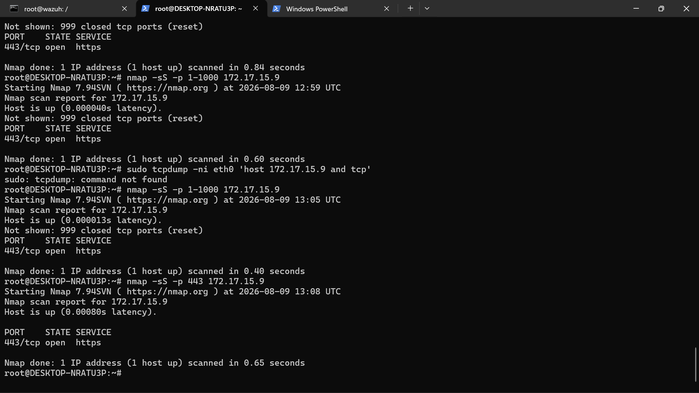
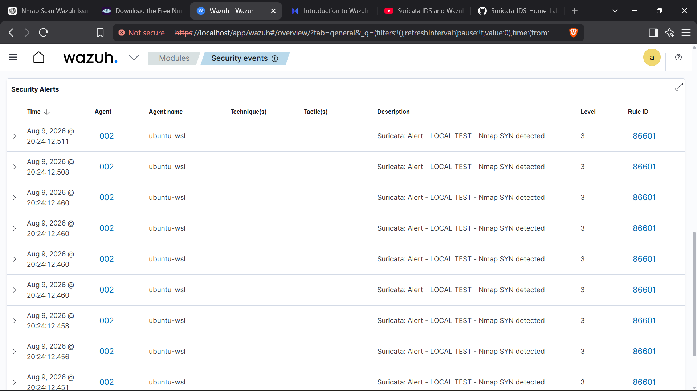

# Lab 01 — Network Detection with Nmap, Suricata & Wazuh

## Overview

This lab demonstrates a basic network detection workflow using **Nmap, Suricata, and Wazuh** in a controlled lab environment.

The objective was to generate network reconnaissance activity, detect the resulting traffic using Suricata, and monitor the generated security event through Wazuh.

## Objective

* Generate controlled network scanning activity using Nmap
* Understand TCP SYN scan traffic
* Configure Suricata to monitor network traffic
* Detect the scanning activity using a Suricata rule
* Generate a security alert
* Forward the alert to Wazuh
* Review and analyze the resulting security event

## Environment

| Component         | Details      |
| ----------------- | ------------ |
| Operating System  | Ubuntu / WSL |
| Network Scanner   | Nmap         |
| IDS               | Suricata     |
| SIEM              | Wazuh        |
| Network Interface | eth0         |

## Detection Workflow

```text
Nmap
  ↓
TCP SYN Scan
  ↓
Network Traffic
  ↓
Suricata IDS
  ↓
Detection Rule
  ↓
Security Alert
  ↓
Wazuh
  ↓
Alert Monitoring & Analysis
```

## 1. Generating Network Activity

I used Nmap to generate TCP SYN scan traffic against the controlled lab target.

Example:

```bash
nmap -sS -p 1-1000 <LAB_TARGET_IP>
```

The scan generated TCP SYN packets that could be inspected by Suricata.

## 2. Suricata Detection

Suricata was configured to monitor the network interface and inspect the generated traffic.

A test detection rule was used to identify the TCP SYN activity.

The generated alert included:

```text
LOCAL TEST - Nmap SYN detected
```

The alert contained information including:

* Source IP
* Destination IP
* Source port
* Destination port
* Protocol
* Alert signature
* Severity

## 3. Wazuh Integration

The Suricata alert was forwarded to Wazuh for centralized security monitoring.

This allowed the network detection event to be viewed as a security event within the Wazuh environment.

## 4. Investigation

The alert was reviewed to understand:

* What activity occurred?
* Which source generated the traffic?
* Which destination was targeted?
* Which protocol was involved?
* What detection rule was triggered?
* Was the activity expected in the lab?

## Result

The lab successfully demonstrated the complete detection pipeline:

```text
Network Activity
      ↓
Suricata Detection
      ↓
Alert Generation
      ↓
Wazuh Monitoring
      ↓
Security Analysis
```

Suricata successfully detected the simulated Nmap TCP SYN activity and generated the test alert:

**LOCAL TEST - Nmap SYN detected**

## Key Learning

This lab helped me understand how network reconnaissance activity can be detected at the IDS layer and then integrated into a SIEM for centralized monitoring.

It also reinforced an important SOC concept:

> An alert is a starting point for investigation, not the conclusion.

The next step in a real investigation would be to correlate the alert with additional logs and activity to determine whether the behavior is expected or potentially suspicious.

## Screenshots

### Nmap Scan



### Suricata Alert



## Disclaimer

This lab was performed in a controlled environment for educational and defensive security purposes. Security testing should only be performed against systems for which I have authorization.
